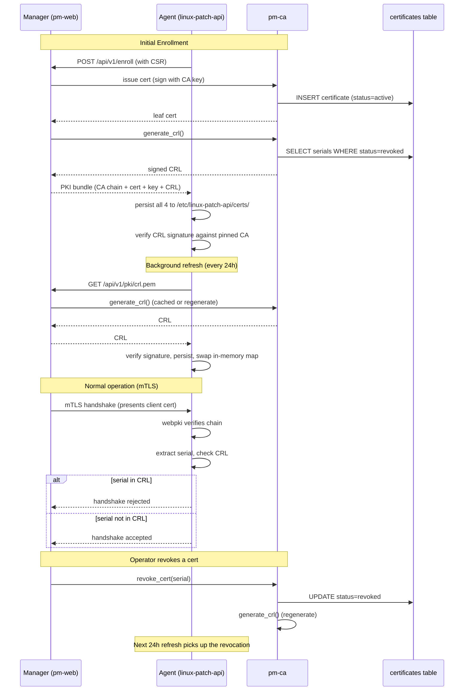

# Issue #7: Certificate Revocation Enforcement — Full CRL Design

**GitHub Issue:** https://github.com/Draco-Lunaris/Linux-Patch-Manager/issues/7
**Companion issue (agent repo):** https://github.com/Draco-Lunaris/Linux-Patch-Api/issues/20
**Status:** Design finalized — implementation pending
**Repos affected:** linux-patch-manager (this), linux-patch-api (agent)
**Last updated:** 2026-06-05

---

## 1. Goal

Enforce certificate revocation at the mTLS handshake by having the manager (CA operator) publish a Certificate Revocation List (CRL) and the agent (linux-patch-api) consult it during TLS client certificate validation.

**Connection direction:** The manager (this repo) is the mTLS client. The agent (linux-patch-api) is the mTLS server. The manager connects TO the agent and presents a client cert. The agent validates it. Agent-to-manager connections occur only for enrollment.

---

## 2. Architecture

### 2.1 Components

```
┌──────────────────┐                        ┌──────────────────────┐
│   pm-web         │                        │  linux-patch-api     │
│   (manager)      │   GET /pki/crl.pem     │  (agent)             │
│                  │ ◄──────────────────────│                      │
│  ┌────────────┐  │   on enrollment +      │  ┌────────────────┐  │
│  │ pm-ca      │  │   every 24h            │  │ mTLS server    │  │
│  │ (signs     │  │                        │  │ (validates     │  │
│  │  certs +   │  │   Bundle: CA chain +   │  │  client certs  │  │
│  │  CRLs)     │  │   client cert +        │  │  + CRL check)  │  │
│  └────────────┘  │   client key +         │  └────────────────┘  │
│                  │   CRL                   │                      │
└──────────────────┘                        └──────────────────────┘
         │                                           │
         │  Health check (existing infra)            │
         │  + CRL age on agent side                  │
         └───────────────────────────────────────────┘
```

### 2.2 Mermaid flow diagram



### 2.3 Sub-CA handling

**Both root and sub-CA modes are supported.**

- **Root mode:** Manager is a self-signed CA. The CA cert in the bundle is also the trust anchor. CRL signature chains directly to it.
- **Sub-CA mode:** Manager is a sub-CA under an external root. The enrollment bundle includes the full chain: external root + manager's intermediate cert. The agent pins both. CRL signature chains up to the external root.

**Required code change for sub-CA support:** Extend `PkiBundle` to include the full chain (new `ca_chain` field containing intermediate + root as a single PEM bundle). The existing single `ca_crt` field is preserved for backward compat (it becomes the leaf-most cert in the chain).

The external root's own CRL is **out of scope** for this design. Documented assumption: the external root is long-lived and trusted by the agent's system trust store, or the operator accepts the risk of a long-lived external root.

### 2.4 Cert lifetime

**No change to current 1-year lifetime.** Revocation lag of up to 24h is acceptable given the 1-year cert validity. Shortening to 90 days was considered and deferred (Phase 1+ works correctly with either lifetime).

---

## 3. Final Decisions (12 concerns walked through with Kelly)

| # | Concern | Decision |
|---|---------|----------|
| 1 | Sub-CA enrollment bundle chain | Extend `PkiBundle` to include full chain (intermediate + root) as new `ca_chain` field. Single `ca_crt` field preserved for backward compat. |
| 2 | CRL generation library | rcgen 0.13 on manager (sign). x509-parser on agent (parse). webpki for chain validation in custom verifier. No new system deps. |
| 3 | Custom ClientCertVerifier | Use rustls `danger::ClientCertVerifier` trait. Wrapper struct delegates chain validation to `WebPkiClientVerifier`, adds serial lookup against parsed CRL. Only ~80 lines of custom code. |
| 4 | Stale-CRL failure mode | (c) Degraded. Continue serving with stale CRL, log warning, health check reports degraded. Missing CRL = degraded. Invalid signature = refuse to start (fail-closed). |
| 5 | CRL size at scale | Not a concern. Max 2500 clients/manager. CRLs KB-range. No index on (status, not_after) needed. |
| 6 | Health check backward compat | Missing `crl_status` field from older agent = degraded (not unhealthy). New agent with missing > 24h after enrollment = unhealthy. UI: host details page + list icon + dashboard widget. |
| 7 | Test coverage | Layers 1-3 (unit + property + integration) required for ship. Layer 4 (E2E docker-compose) incremental. Layer 5 (fuzz) added now. Property-based tests with `proptest` added now. |
| 8 | Deployment order | 6 PRs sequential. No feature flag (disk state is the implicit flag). All-at-once rollout for PR 2 (agent). |
| 9 | Documentation | Full scope. New `docs/security/revocation.md` as top-level doc. Mermaid diagrams in markdown (GitHub renders natively). |
| 10 | Phasing risk | Low. Pre-production stage, no live users to disrupt. Bounded window between PR 1 and PR 2. |
| 11 | mTLS direction | Confirmed. Manager = client, agent = server. Agent-to-manager only for enrollment. |
| 12 | New host enrollment during CRL outage | Enrollment succeeds without CRL. Health check reports missing. Agent fetches CRL on next refresh cycle. |

---

## 4. Phased Implementation (6 PRs)

### PR 1 — Manager: CRL generation + endpoint + enrollment bundle

**Repo:** linux-patch-manager (this)
**Scope:**
- Extend `PkiBundle` to include full chain (new `ca_chain` field)
- Add `generate_crl()` to `pm-ca/src/ca.rs` using rcgen 0.13
- Add `GET /api/v1/pki/crl.pem` route in new `crates/pm-web/src/routes/pki.rs`
- Include CRL PEM in enrollment response
- Background task: regenerate CRL every 12h and on every `revoke_cert` call
- No DB schema changes

**Testing:**
- Unit tests for `generate_crl()` (revoked serials present, non-revoked absent, expired excluded)
- Property tests (proptest) for CRL generation roundtrip
- Fuzz harness for CRL generation
- Integration test: `GET /pki/crl.pem` returns 200 + valid PEM + correct `Cache-Control`
- Integration test: enrollment bundle includes CRL

**Backward compat:** Endpoint is dark until an agent is updated to consume it. Older agents ignore it. Zero impact on existing flows.

---

### PR 2 — Agent: CRL consumption + custom verifier

**Repo:** linux-patch-api
**Scope:**
- New `src/auth/crl.rs` module: CRL load, signature verification, in-memory serial map (ArcSwap)
- New `src/auth/crl_refresh.rs`: background task fetching CRL every 24h from `GET {manager_url}/api/v1/pki/crl.pem`
- Extend `src/auth/mtls.rs`: replace direct `WebPkiClientVerifier` usage with `CrlClientCertVerifier` wrapper
- Persist CRL to `/etc/linux-patch-api/certs/crl.pem`
- Config additions: `crl_path`, `crl_refresh_interval`, `manager_url`

**Custom verifier (sketch):**

```rust
pub struct CrlClientCertVerifier {
    inner: Arc<dyn rustls::client::danger::ClientCertVerifier>,
    crl: arc_swap::ArcSwap<Crl>,
}

impl rustls::client::danger::ClientCertVerifier for CrlClientCertVerifier {
    fn verify_client_cert(
        &self,
        end_entity: &CertificateDer<'_>,
        intermediates: &[CertificateDer<'_>],
        now: UnixTime,
    ) -> Result<ClientCertVerified, rustls::Error> {
        // Delegate chain validation to WebPKI (battle-tested)
        self.inner.verify_client_cert(end_entity, intermediates, now)?;
        
        // Extract serial from the leaf cert
        let serial = extract_serial(end_entity)
            .map_err(|e| rustls::Error::General(format!("serial extract: {}", e)))?;
        
        // Check CRL (O(1) hash lookup)
        let crl = self.crl.load();
        if crl.is_revoked(serial) {
            return Err(rustls::Error::General(format!(
                "cert serial {} is revoked", serial
            )));
        }
        
        Ok(ClientCertVerified::assertion())
    }
    
    // Delegate remaining trait methods to self.inner
    fn supported_verify_schemes(&self) -> Vec<rustls::SignatureScheme> {
        self.inner.supported_verify_schemes()
    }
    
    fn verify_tls12_signature(&self, ...) -> Result<...> {
        self.inner.verify_tls12_signature(...)
    }
    
    fn verify_tls13_signature(&self, ...) -> Result<...> {
        self.inner.verify_tls13_signature(...)
    }
}
```

**Backward compat:** If CRL file is missing or fails signature verification, fall back to `WebPkiClientVerifier` directly (current behavior). Log warning. Health check from manager reports degraded.

**Testing:**
- Unit tests: CRL load (valid, malformed, missing, tampered, expired)
- Unit tests: custom verifier (valid cert accepted, revoked cert rejected, no false positives)
- Property tests (proptest): random certs + random CRLs, no false negs/pos
- Fuzz harness for CRL load and verifier
- Integration test: end-to-end mTLS (valid cert connects, revoked cert rejected)
- Integration test: stale CRL fallback to WebPKI (no connection rejection)

---

### PR 3 — Manager: Health check schema + UI

**Repo:** linux-patch-manager (this)
**Scope:**
- Extend health check response schema to include `crl_status` and `crl_age_seconds` fields (optional, backward compat)
- Add UI: CRL section in host details page
- Add hosts list icon (green/yellow/red) for CRL status
- Add dashboard widget: "hosts with degraded CRL: N"

**Backward compat:** Older agents don't report these fields → UI shows "CRL not configured". No regression.

---

### PR 4 — Agent: Health response includes CRL status

**Repo:** linux-patch-api
**Scope:**
- Add `crl_status` and `crl_age_seconds` to the agent's health response payload
- Logic: `valid` if CRL loaded + signature good + not expired, `expired` if `nextUpdate` passed, `missing` if no CRL on disk, `invalid` if signature fails

**Backward compat:** Field is additive. Manager treats missing field as "unknown" / "missing".

---

### PR 5 — Manager: Health aggregation logic

**Repo:** linux-patch-manager (this)
**Scope:**
- Aggregate per-host CRL health into the host's overall health
- Implement severity rules: invalid signature → unhealthy; missing > 24h on new agent → unhealthy; missing on old agent → degraded; > 25h old → degraded; otherwise healthy
- Add audit events: `CrlStaleDetected`, `CrlMissing`, `CrlInvalid`

**Backward compat:** Logic only fires when PR 3 + PR 4 are deployed. Safe to merge ahead of those.

---

### PR 6 — E2E integration test harness

**Repos:** both (new `tests/e2e/` directory in this repo, mirroring setup in agent repo)
**Scope:**
- docker-compose harness running both pm-web and linux-patch-api
- Test scenarios:
  - Issue → enroll → connect (fresh agent connects successfully)
  - Issue → enroll → revoke → refresh → connect (rejected)
  - Issue → enroll → revoke → no refresh → connect (succeeds with stale CRL + warning)
  - Manager down → connect (succeeds with stale CRL + degraded health)
- Independent CI for each repo; full E2E runs on main branch merges

**Backward compat:** Test-only, no production impact.

---

## 5. Failure Modes and Operational Behavior

### 5.1 Stale CRL on agent

**Scenario:** Agent's CRL has `nextUpdate` passed. Background refresh fails (manager unreachable).

**Behavior:**
- Agent continues serving mTLS connections using the stale CRL
- Logs warning every refresh attempt
- Reports `crl_status=expired` and `crl_age_seconds` in health response
- Manager's health aggregation marks host as `degraded`
- Worst case: ~24h of accepting a cert that was revoked after the agent's CRL was generated
- The cert's `not_after` is still the hard backstop (1 year from issuance)

### 5.2 Missing CRL on agent

**Scenario:** New agent enrolls, but CRL generation fails on the manager. Or older agent predates CRL feature.

**Behavior:**
- Agent starts with no CRL on disk
- Falls back to `WebPkiClientVerifier` (chain validation only, no CRL check)
- Logs warning, reports `crl_status=missing`
- Manager's health aggregation marks host as `degraded`
- If host is a newer agent: 24h after enrollment without CRL → escalates to `unhealthy`
- If host is an older agent: stays `degraded` indefinitely (feature gap, not a failure)

### 5.3 Invalid CRL signature on agent

**Scenario:** CRL file is corrupted, or the manager's CA key was compromised.

**Behavior:**
- Agent refuses to load the CRL
- **Refuses to start the mTLS server** (fail-closed here, because invalid signature is a security event)
- Logs critical error
- Reports `crl_status=invalid` in health response
- Operator must investigate: check manager's CA, re-fetch CRL manually, or restore from backup

### 5.4 Manager unreachable during enrollment

**Scenario:** New agent tries to enroll. Manager is down.

**Behavior:**
- Enrollment fails (manager is required for cert issuance)
- Agent retries on its configured enrollment schedule
- Once manager is back, enrollment succeeds, agent receives cert + CA + CRL (if available)

### 5.5 New host enrollment during CRL outage

**Scenario:** Manager is up, cert issuance works, but CRL generation fails (e.g., DB issue during `generate_crl`).

**Behavior:**
- Enrollment succeeds
- Agent receives cert + CA chain, but **no CRL** in the bundle
- Agent starts with no CRL, falls back to WebPKI
- Reports `crl_status=missing`
- Next 24h refresh attempts to fetch CRL from `/pki/crl.pem`
- If CRL generation is fixed by then, agent picks it up on next refresh
- If still failing, agent continues in degraded mode

---

## 6. Acceptance Criteria

### Phase 1 (Manager-side MVP)

- [ ] `generate_crl()` produces a valid X.509 CRL signed by the same CA key that signs leaf certs
- [ ] CRL includes only certs where `status='revoked' AND not_after > NOW()`
- [ ] `GET /api/v1/pki/crl.pem` returns 200 + valid PEM + `Cache-Control: max-age=3600`
- [ ] Enrollment PKI bundle includes the CRL
- [ ] Enrollment bundle includes the full CA chain (new `ca_chain` field)
- [ ] Background task regenerates CRL every 12h
- [ ] `revoke_cert` triggers immediate CRL regeneration
- [ ] Unit tests, property tests, fuzz harness, integration tests all pass

### Phase 2 (Agent-side consumption)

- [ ] Agent fetches CRL on enrollment from enrollment bundle
- [ ] Agent persists CRL to `/etc/linux-patch-api/certs/crl.pem`
- [ ] Agent verifies CRL signature against pinned CA on load
- [ ] Agent uses `CrlClientCertVerifier` wrapper that delegates to WebPKI + adds CRL check
- [ ] Revoked cert is rejected at mTLS handshake with clear error
- [ ] Valid (non-revoked) cert is accepted
- [ ] Background task refreshes CRL every 24h (configurable)
- [ ] Missing CRL falls back to WebPKI (degraded mode, not fail-closed)
- [ ] Invalid CRL signature causes agent to refuse to start
- [ ] Unit tests, property tests, fuzz harness, integration tests all pass

### Phase 3 (Health monitoring + UI)

- [ ] Health response includes `crl_status` and `crl_age_seconds`
- [ ] Host details page shows CRL section (status, age, next update, last refresh)
- [ ] Hosts list shows CRL status icon (green/yellow/red)
- [ ] Dashboard widget shows count of hosts with degraded CRL
- [ ] Health aggregation: invalid signature → unhealthy
- [ ] Health aggregation: new agent missing > 24h → unhealthy
- [ ] Health aggregation: old agent missing → degraded
- [ ] Health aggregation: > 25h old → degraded
- [ ] Audit events: `CertRevoked`, `CrlGenerated`, `CrlFetched`, `CrlStaleDetected`, `CrlMissing`, `CrlInvalid`

### Phase 4 (E2E tests)

- [ ] docker-compose harness runs both pm-web and linux-patch-api
- [ ] E2E test: issue → enroll → connect (succeeds)
- [ ] E2E test: issue → enroll → revoke → refresh → connect (rejected)
- [ ] E2E test: issue → enroll → revoke → no refresh → connect (succeeds with stale CRL)
- [ ] E2E test: manager down → connect (succeeds with stale CRL, degraded health)

### Documentation

- [ ] `docs/security/revocation.md` (NEW) — revocation policy and operational behavior
- [ ] `docs/architecture/pki.md` updated with CRL section + sub-CA section
- [ ] `docs/architecture/health-monitoring.md` updated with CRL health states
- [ ] `docs/architecture/agent-cert-flow.md` (NEW) — end-to-end flow with mermaid diagram
- [ ] `docs/api/REST_API.md` (or equivalent) updated with new endpoint
- [ ] `docs/operations/upgrade-guide.md` updated with rollout notes
- [ ] `docs/operations/crl-troubleshooting.md` (NEW) — common issues and diagnostics
- [ ] Inline code docs on all new public functions/structs
- [ ] `CHANGELOG.md` entry for the release that lands Phase 1
- [ ] `linux-patch-api/config.example.toml` updated with new CRL config keys
- [ ] `linux-patch-manager/config.example.toml` updated with new CRL config keys

---

## 7. Sign-off

**All 12 concerns resolved.** Design is finalized. Implementation can begin.

**Next action:** Start PR 1 (Manager: CRL generation + endpoint + enrollment bundle).

The companion issue on linux-patch-api (#20) is filed and tracks the agent-side changes for PR 2 and PR 4.

**Documented assumptions (must be confirmed before production deployment):**
1. The external root in sub-CA mode is long-lived and trusted. Its own CRL is not consulted.
2. 1-year cert lifetime is acceptable; revocation lag of up to 24h is the operational upper bound.
3. Operators accept that during a CRL refresh failure, revoked certs may be accepted for up to 24h (the cert's `not_after` is the hard backstop).
4. Max ~2500 clients per manager. If this changes, revisit CRL size and consider OCSP.